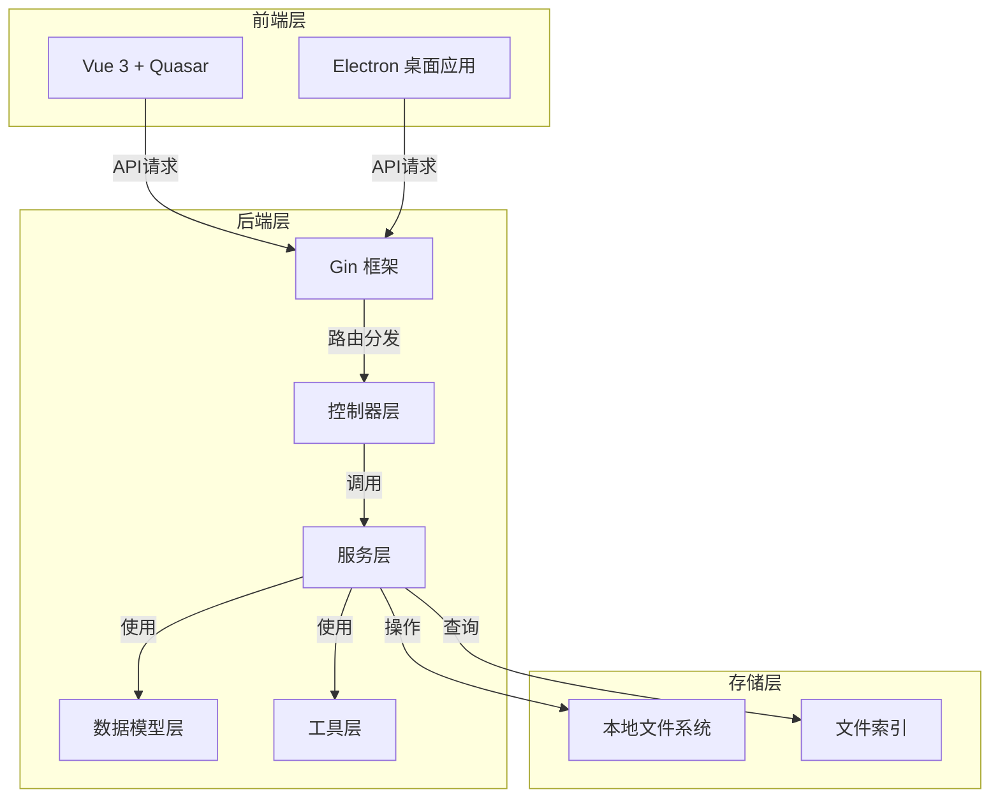

# gosrc 文件管理系统 - Code Wiki

## 1. 项目概览

**gosrc** 是一款基于 Golang + Vue3 (Quasar) 开发的本地磁盘文件搜索与管理系统，支持文件检索、图片浏览、视频播放等多种功能。

### 1.1 核心功能
- **本地文件搜索**：快速检索本地磁盘中的文件
- **图片浏览**：支持图片文件的在线预览
- **视频播放**：集成视频播放功能，支持多种格式
- **文件管理**：对搜索结果进行管理和操作
- **系统设置**：灵活的系统配置选项

### 1.2 技术栈

| 层级 | 技术栈 |
|------|--------|
| 后端 | Golang |
| Web 框架 | Gin |
| 前端框架 | Vue 3 + Quasar |
| 桌面应用 | Electron + Quasar |
| 视频处理 | FFmpeg |

## 2. 项目架构

### 2.1 整体架构



### 2.2 目录结构

```
search-gin/
├── gosrc/                # 后端项目
│   ├── conf/             # 配置文件
│   ├── cons/             # 常量定义
│   ├── controller/       # 控制器
│   ├── datamodels/       # 数据模型
│   ├── debugTest/        # 测试代码
│   ├── router/           # 路由配置
│   ├── service/          # 服务层
│   ├── utils/            # 工具类
│   ├── main.go           # 后端入口
│   └── go.mod            # Go模块依赖
├── electron_quasar/      # 前端项目
│   ├── src/              # Vue源码
│   ├── src-electron/     # Electron源码
│   └── quasar.config.js  # Quasar配置
├── oldVersion/           # 旧版本代码
├── buildQuasar.sh        # 构建脚本
└── README.md             # 项目说明
```

## 3. 核心模块

### 3.1 后端模块

#### 3.1.1 搜索引擎模块 (service/index_engin.go)

**功能**：实现文件索引和搜索功能，是系统的核心模块。

**关键组件**：
- `searchEnginCore`：搜索引擎核心结构，包含索引映射、缓存和搜索逻辑
- `Page()`：分页搜索函数，支持关键词搜索和排序
- `PageAsync()`：异步搜索实现，提高搜索性能
- `buildIndexEngin()`：构建索引引擎，包括文件索引、重复文件检测和演员信息提取

**搜索流程**：
1. 接收搜索参数（关键词、排序方式等）
2. 检查缓存中是否有匹配结果
3. 遍历搜索索引映射，执行搜索
4. 对结果进行排序和分页
5. 缓存搜索结果
6. 返回分页结果

#### 3.1.2 文件服务模块 (service/file_service.go)

**功能**：处理文件扫描、管理和操作。

**关键功能**：
- 文件系统扫描
- 文件元数据提取
- 文件操作（重命名、移动、删除等）
- 视频处理（转码、剪切等）

#### 3.1.3 控制器模块 (controller/)

**功能**：处理HTTP请求，调用服务层方法，返回响应。

**主要控制器**：
- `search_controller.go`：处理搜索相关请求
- `file_controller.go`：处理文件操作请求
- `setting_controller.go`：处理系统设置请求
- `home_controller.go`：处理首页相关请求

#### 3.1.4 路由模块 (router/BuildRouter.go)

**功能**：定义API端点和路由规则。

**主要路由**：
- `/api/movieList`：电影文件搜索
- `/api/actressList`：演员信息搜索
- `/api/file/*`：文件操作
- `/api/setting`：系统设置

### 3.2 前端模块

#### 3.2.1 Vue组件

**主要页面**：
- 搜索页面：实现文件搜索功能
- 图片浏览页面：预览图片文件
- 视频播放页面：播放视频文件
- 设置页面：配置系统参数

#### 3.2.2 Electron应用

**功能**：提供桌面应用体验，包装Web应用。

## 4. 核心 API/类/函数

### 4.1 后端核心API

#### 4.1.1 搜索相关

| API路径 | 方法 | 功能 | 模块 |
|---------|------|------|------|
| `/api/movieList` | POST | 搜索电影文件 | [search_controller.go](file:///workspace/search-gin/gosrc/controller/search_controller.go) |
| `/api/actressList` | POST | 搜索演员信息 | [search_controller.go](file:///workspace/search-gin/gosrc/controller/search_controller.go) |
| `/api/refreshIndex` | GET | 刷新文件索引 | [setting_controller.go](file:///workspace/search-gin/gosrc/controller/setting_controller.go) |

#### 4.1.2 文件操作

| API路径 | 方法 | 功能 | 模块 |
|---------|------|------|------|
| `/api/file/:id` | GET | 获取文件信息 | [file_controller.go](file:///workspace/search-gin/gosrc/controller/file_controller.go) |
| `/api/file/rename` | POST | 重命名文件 | [file_controller.go](file:///workspace/search-gin/gosrc/controller/file_controller.go) |
| `/api/file/move` | POST | 移动文件 | [file_controller.go](file:///workspace/search-gin/gosrc/controller/file_controller.go) |
| `/api/delete/:id` | GET | 删除文件 | [file_controller.go](file:///workspace/search-gin/gosrc/controller/file_controller.go) |

#### 4.1.3 媒体处理

| API路径 | 方法 | 功能 | 模块 |
|---------|------|------|------|
| `/api/play/:id` | GET | 播放视频 | [file_controller.go](file:///workspace/search-gin/gosrc/controller/file_controller.go) |
| `/api/png/:path` | GET | 获取图片 | [file_controller.go](file:///workspace/search-gin/gosrc/controller/file_controller.go) |
| `/api/cutMovie/:id/:start/:end` | GET | 剪切视频 | [file_controller.go](file:///workspace/search-gin/gosrc/controller/file_controller.go) |

### 4.2 核心类与函数

#### 4.2.1 searchEnginCore

**功能**：搜索引擎核心类，负责索引管理和搜索操作。

**主要方法**：
- `Init(baseDirs []string)`：初始化搜索索引
- `Page(searchParam datamodels.SearchParam)`：执行分页搜索
- `PageAsync(searchParam datamodels.SearchParam)`：异步执行分页搜索
- `buildIndexEngin()`：构建搜索索引
- `FindById(id string)`：根据ID查找文件

#### 4.2.2 FileService

**功能**：文件服务类，负责文件扫描和管理。

**主要方法**：
- `ScanAll()`：扫描所有配置的目录
- `HeartBeat()`：心跳检测，定期扫描文件变化
- `TaskExecuting()`：执行文件转换任务

#### 4.2.3 BuildRouter

**功能**：构建Gin路由。

**参数**：无

**返回值**：`*gin.Engine` - 配置好的Gin引擎实例

## 5. 技术实现细节

### 5.1 搜索实现

1. **索引结构**：使用 `sync.Map` 存储索引，键为目录路径，值为 `bucketFile` 类型的索引桶。

2. **搜索优化**：
   - 使用LRU缓存存储搜索历史，提高重复搜索性能
   - 支持异步搜索，使用goroutine池控制并发数量
   - 对结果进行排序和分页，减少网络传输数据量

3. **重复文件检测**：
   - 基于文件大小和文件代码检测重复文件
   - 构建重复文件列表，方便用户管理

### 5.2 文件扫描

1. **扫描策略**：
   - 全量扫描：首次启动或手动触发时执行
   - 增量扫描：通过心跳检测定期执行，只扫描变化的文件

2. **元数据提取**：
   - 提取文件基本信息（名称、大小、路径等）
   - 提取视频文件的元数据（时长、分辨率等）
   - 生成视频缩略图

### 5.3 视频处理

1. **依赖**：使用FFmpeg进行视频处理

2. **功能**：
   - 视频转码：将其他格式转换为MP4
   - 视频剪切：根据时间范围剪切视频
   - 视频合并：合并多个视频文件

## 6. 依赖关系

### 6.1 后端依赖

| 依赖 | 版本 | 用途 | 来源 |
|------|------|------|------|
| gin-gonic/gin | 最新 | Web框架 | [go.mod](file:///workspace/search-gin/gosrc/go.mod) |
| gin-contrib/cors | 最新 | CORS中间件 | [go.mod](file:///workspace/search-gin/gosrc/go.mod) |
| toorop/gin-logrus | 最新 | 日志中间件 | [go.mod](file:///workspace/search-gin/gosrc/go.mod) |
| golang.org/x/sync | 最新 | 并发工具 | [go.mod](file:///workspace/search-gin/gosrc/go.mod) |
| FFmpeg | 外部 | 视频处理 | [ffmpeg.exe](file:///workspace/search-gin/gosrc/ffmpeg.exe) |

### 6.2 前端依赖

| 依赖 | 版本 | 用途 | 来源 |
|------|------|------|------|
| Vue 3 | 最新 | 前端框架 | [package.json](file:///workspace/search-gin/electron_quasar/package.json) |
| Quasar | 最新 | UI框架 | [package.json](file:///workspace/search-gin/electron_quasar/package.json) |
| Electron | 最新 | 桌面应用框架 | [package.json](file:///workspace/search-gin/electron_quasar/package.json) |
| Axios | 最新 | HTTP客户端 | [package.json](file:///workspace/search-gin/electron_quasar/package.json) |
| DPlayer | 最新 | 视频播放器 | [package.json](file:///workspace/search-gin/electron_quasar/package.json) |

## 7. 部署与运行

### 7.1 Web系统部署

```bash
# 执行打包脚本
sh buildQuasar.sh 2

# 生成 qapp 文件夹（可移动）
# 点击 exe 启动 Web 服务
# 访问端口: http://localhost:10081
```

### 7.2 桌面应用部署

```bash
# 执行打包脚本
sh buildQuasar.sh 4

# 生成桌面应用包
# 目录: electron_quasar/dist/electron/Packaged/文件搜索系统-win32-x64
# 点击【文件搜索系统.exe】启动桌面软件
```

### 7.3 开发环境运行

#### 后端

```bash
# 进入后端目录
cd gosrc

# 安装依赖
go mod tidy

# 运行后端服务
go run main.go
```

#### 前端

```bash
# 进入前端目录
cd electron_quasar

# 安装依赖
npm install

# 运行开发服务器
quasar dev
```

## 8. 配置说明

### 8.1 后端配置

配置文件位于 `gosrc/conf/` 目录：
- `config.go`：基础配置
- `dev_config.go`：开发环境配置
- `prod_config.go`：生产环境配置

### 8.2 系统设置

通过前端设置页面或直接修改 `setting.json` 文件进行配置：
- 扫描目录：设置要索引的本地目录
- 搜索参数：配置搜索行为
- 系统参数：配置服务端口等

## 9. 监控与维护

### 9.1 日志系统

系统使用自定义日志工具 `utils/Logger.go` 记录运行状态和错误信息。

### 9.2 性能监控

- 后端提供 `/api/logMemery` 接口查看内存使用情况
- 开发模式下，系统会记录慢请求（超过5秒）
- 提供 `/api/heartBeat` 接口检查系统运行状态

### 9.3 常见问题

| 问题 | 可能原因 | 解决方案 |
|------|----------|----------|
| 搜索结果为空 | 索引未构建 | 手动触发索引刷新：访问 `/api/refreshIndex` |
| 视频无法播放 | FFmpeg未正确安装 | 确保FFmpeg可执行文件在正确位置 |
| 服务启动失败 | 端口被占用 | 修改配置文件中的端口设置 |

## 10. 总结与亮点回顾

### 10.1 项目亮点

1. **高效搜索**：使用内存索引和缓存机制，实现快速文件搜索
2. **多平台支持**：同时支持Web浏览器和桌面应用
3. **媒体处理**：集成FFmpeg，支持视频转码、剪切等功能
4. **异步处理**：使用goroutine池实现并发搜索，提高性能
5. **用户友好**：现代化的Vue 3 + Quasar前端界面

### 10.2 技术价值

- 展示了如何使用Golang构建高性能的本地文件搜索系统
- 演示了Vue 3 + Quasar + Electron的全栈开发流程
- 提供了文件管理系统的完整实现方案
- 展示了如何集成FFmpeg进行视频处理

### 10.3 应用场景

- 个人文件管理：快速查找和管理本地文件
- 媒体库管理：整理和浏览图片、视频文件
- 内容创作者：快速定位和处理媒体文件
- 开发人员：作为学习Golang和Vue全栈开发的参考项目

## 11. 参考资料

- [Gin框架文档](https://gin-gonic.com/docs/)
- [Vue 3文档](https://vuejs.org/docs/)
- [Quasar文档](https://quasar.dev/)
- [Electron文档](https://www.electronjs.org/docs)
- [FFmpeg文档](https://ffmpeg.org/documentation.html)
